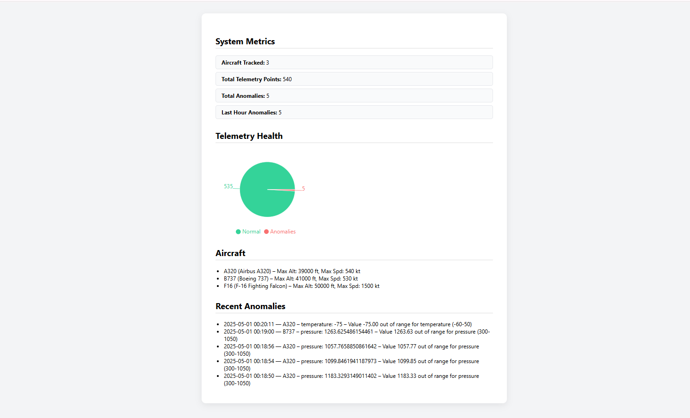
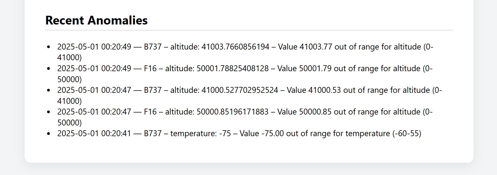
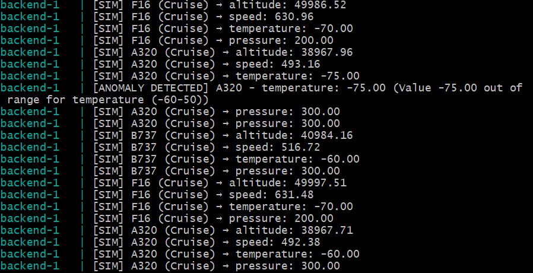

# ✈️ Aerospace Telemetry Hub

A real-time aerospace telemetry backend + dashboard system built with Docker, PostgreSQL, GraphQL, Node.js, and React. Simulates telemetry data from aircraft, detects anomalies, and visualizes everything in a secure dashboard — production-ready and AWS-deployable.

---

## 🚀 Features

- 📡 **Real-Time Telemetry Simulation**  
  Simulates data from multiple aircraft (altitude, speed, pressure, temperature)

- ⚠️ **Anomaly Detection System**  
  Flags readings that fall outside safe operating thresholds per aircraft type

- 📊 **GraphQL API**  
  Powerful query support for telemetry, anomalies, and aircraft metadata

- 🔐 **JWT-Based Admin Auth**  
  Secure login to access protected routes

- 📈 **Live Dashboard UI**  
  Minimalist React frontend with real-time updates, pie/line charts, and anomaly list

- 🐳 **Dockerized**  
  Fully containerized frontend, backend, and PostgreSQL database with `docker-compose`

---

## 🧰 Tech Stack

| Layer         | Tech                            |
|---------------|---------------------------------|
| Backend       | Node.js, Express, GraphQL       |
| Frontend      | React, CSS, Recharts            |
| Database      | PostgreSQL (local or AWS RDS)   |
| Auth          | JSON Web Tokens (JWT)           |
| DevOps        | Docker, Docker Compose          |
| Cloud Ready   | AWS ECS (Fargate), ECR, RDS     |

---

## 📸 Screenshots

| Login | Dashboard |
|-------|-----------|
|  |  |

| Anomalies | Console |
|-----------|---------|
|  |  |

---

## ⚙️ How to Run Locally

### 📦 Prerequisites

- [Docker](https://docs.docker.com/get-docker/) + Docker Compose

### 🧪 Steps

1.  **Clone the repo:**

    ```bash
    git clone [https://github.com/your-username/aerospace-telemetry-hub.git](https://github.com/your-username/aerospace-telemetry-hub.git)
    cd aerospace-telemetry-hub
    ```

2.  **Create a `.env` file in `backend/`:**

    ```env
    DATABASE_URL=postgresql://postgres:postgres@db:5432/aerospace
    ADMIN_USERNAME=admin
    ADMIN_PASSWORD=password
    JWT_SECRET=your-jwt-secret-key
    ```

3.  **Start the app:**

    ```bash
    docker-compose down -v
    docker-compose up --build
    ```

4.  **Open in browser:**
    * Frontend: http://localhost:3000
    * Backend (GraphQL): http://localhost:4000/graphql

---
### ✅ Admin Login

```pgsql
Username: admin
Password: password
```

---
### 📈 Anomaly Detection

Each aircraft type includes defined thresholds for:

* Max altitude
* Max speed
* Safe temperature and pressure ranges

If telemetry data exceeds these limits, anomalies are:

* Detected in real-time
* Stored in the database
* Exposed via GraphQL

**Example anomaly:**

```
[ANOMALY DETECTED] F16 - speed: 945.21 (Value out of range for speed (0–900))
```

---
### ☁️ Cloud Deployment (Optional)

This project is prepared for production deployment via:

* Amazon ECS (Fargate) — container orchestration
* Amazon ECR — image storage
* Amazon RDS — managed PostgreSQL
* Application Load Balancer — optional frontend/backend routing

---
### 🎓 Learning Outcomes

This project demonstrates:

* Backend architecture for real-time data + anomaly logic
* GraphQL API design and filtering
* PostgreSQL schema design + seeding
* Secure JWT authentication
* Multi-service orchestration with Docker Compose
* AWS ECS + RDS readiness
* Frontend dashboard with charts + polling
